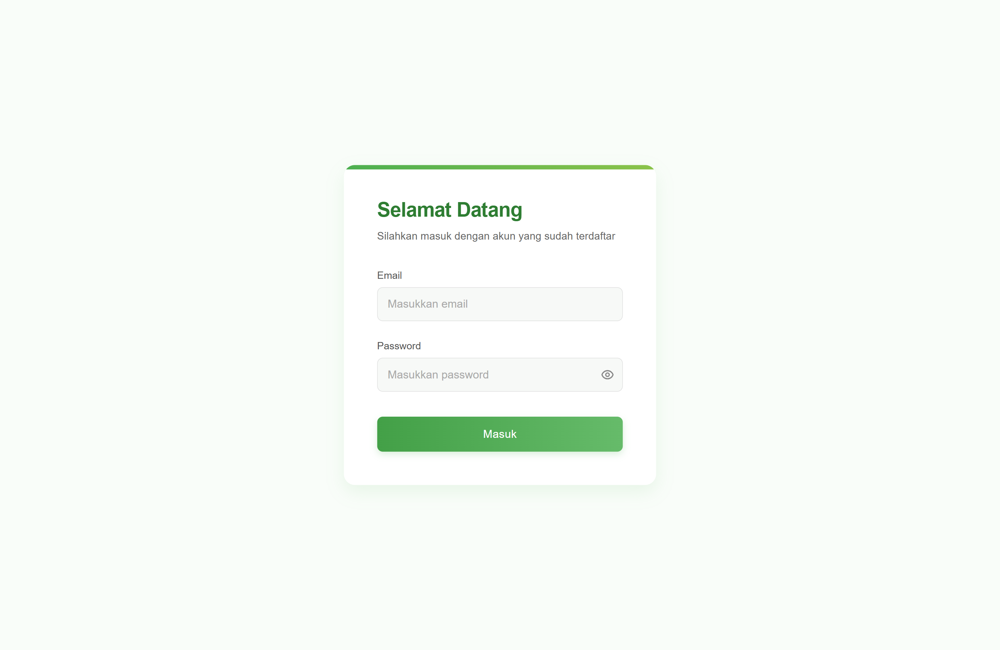
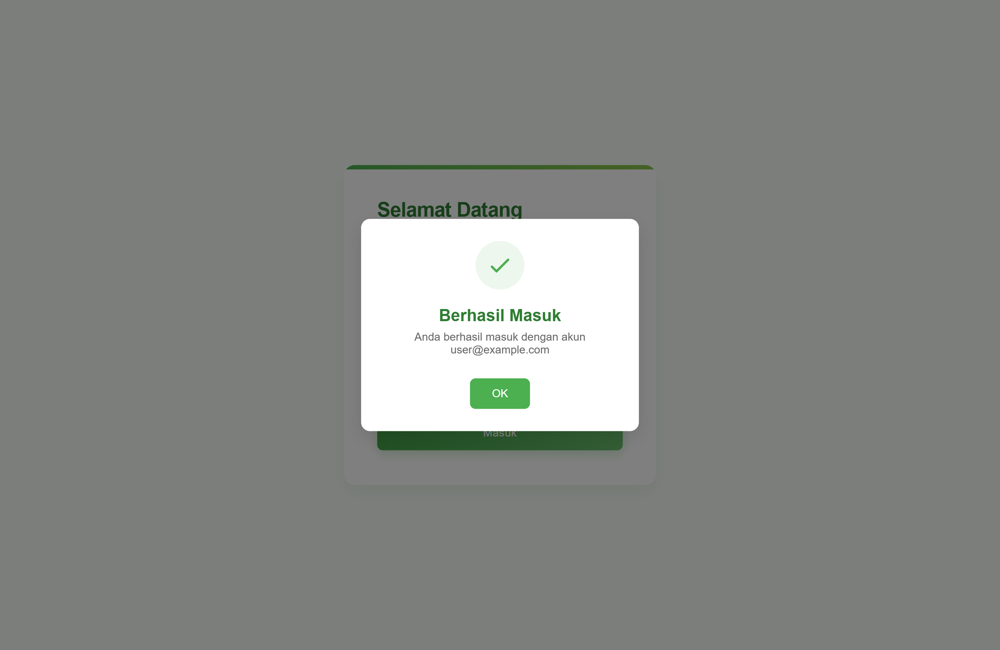
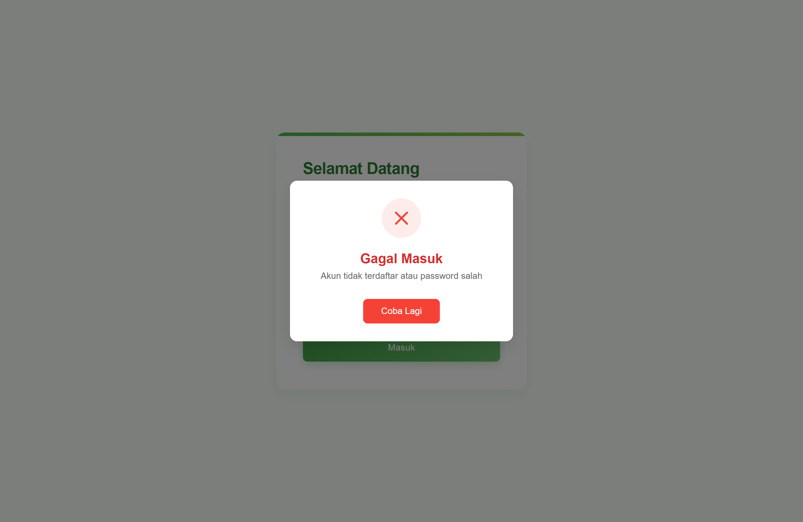

# Login Page with Popup Notifications

## Overview

This project is a simple HTML and CSS-based login page with JavaScript-powered success and error popup notifications. The design is clean and modern, featuring a styled login form with smooth animations and feedback messages for login attempts.

## Screenshots

### 1. Login Page



### 2. Success Popup



### 3. Error Popup



## How to Use

1. Open the `index.html` file in a browser.
2. Enter a registered email and password:
   - Example users:
     - `user@example.com / password123`
     - `admin@example.com / admin123`
     - `test@example.com / test123`
3. Click the "Masuk" button.
4. If login is successful, a success popup appears.
5. If login fails, an error popup appears.
6. Click "OK" or "Coba Lagi" to close the popups.

## File Structure

```
login-page/
│── index.html
│── styles.css 
│── script.js 
│── screenshots/
│   ├── login_page.png
│   ├── success_popup.png
│   ├── error_popup.png
```

## Technologies Used

- **HTML**: Markup structure.
- **CSS**: Styling and animations.
- **JavaScript**: Form validation, popups, and interactivity.